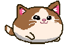

<a id="readme-top"></a>

<!-- PROJECT LOGO -->
<br />
<div align="center">
  <a href="https://github.com/S-rita/Chubby_Cat">
    
  </a>

  <h3 align="center">Chubby Cat</h3>
  <p align="center">
    An imaginative adaptation of the classic Flappy Bird game!
    <br />
    <a href="https://github.com/S-rita/Chubby_Cat"><strong>Explore the program »</strong></a>
    <br />
    <br />
    <a href="https://drive.google.com/file/d/1GP1ge3sabx0YefPhYAnaxp_8LnZK4FVE/view?usp=sharing">View Project Proposal</a>
    ·
    <a href="">Watch the tutorial</a>
    ·
    <a href="">View Project Report</a>
  </p>
</div>


<!-- TABLE OF CONTENTS -->
<details>
  <summary>Table of Contents</summary>
  <ol>
    <li><a href="#overview">Overview</a></li>
    <li><a href="#features">Features</a></li>
    <li><a href="#requirements">Requirements</a></li>
    <li><a href="#installation">Installation</a></li>
    <li><a href="#game-controls">Game Controls</a></li>
    <li><a href="#running_the_game">Running the game</a></li>
    <li><a href="#code_structure">Code structure</a></li>
      <li><a href="#customization">Customization</a></li>
  </ol>
</details>

<!-- OVERVIEW -->
## Overview

The Chubby Cat Game is a Pygame-based project designed for the Raspberry Pi platform, integrating hardware components such as GPIO pins, 7-segment displays, a buzzer, and an MPU-6050 accelerometer. The goal of the game is to guide a chubby cat through a series of obstacles (scratching towers), scoring points while avoiding collisions. The game uses GPIO inputs for user interaction, including a button for jumping and gyro for movement.

<p align="right">(<a href="#readme-top">back to top</a>)</p>


<!-- FEATURES -->
## Features
* Pygame Integration: Utilizes the Pygame library for game rendering and logic.
* Hardware Interaction: Uses GPIO pins for controlling a buzzer, LED, switch input, and a 7-segment display for scoring.
* Obstacle Avoidance: Navigate through dynamically generated towers to score points.
* Score Display: Displays the current score using a 7-segment display.
* Accelerometer Input: Uses MPU-6050 to add additional movement controls based on tilt.
<p align="right">(<a href="#readme-top">back to top</a>)</p>

  
<!-- REQUIREMENTS -->
## Requirements
* Raspberry Pi with Python installed
* Pygame library (`pip install pygame`)
* SMBus library (`smbus`)
* GPIO access (e.g., `RPi.GPIO`)
* MPU-6050 accelerometer module
* Hardware components: LED, Buzzer, 7-segment display, Button switch
<p align="right">(<a href="#readme-top">back to top</a>)</p>

<!-- INSTALLATION -->
## Installation
1. Ensure that Python and Pygame are installed on your Raspberry Pi.
  ```sh
sudo apt-get update
sudo apt-get install python3 python3-pygame
  ```
2. Clone or download the game source files.
3. Connect the hardware components as per the GPIO pin configuration specified in the code.
<p align="right">(<a href="#readme-top">back to top</a>)</p>

<!-- GAME CONTROLS -->
## Game Controls
* Start Game: Press the connected switch.
* Jump: Press the switch again to make the cat jump.
* Adjust Speed: Tilt the MPU-6050.
* Restart Game: Use the switch when the game-over screen is displayed.
<p align="right">(<a href="#readme-top">back to top</a>)</p>


<!-- Running the Game -->
## Running the Game
1. Open a terminal and navigate to the game directory.
2. Run the game using the following command:
  ```sh
    python3 <game_filename>.py
  ```
  Replace <game_filename> with the actual script name (chubby.py)
<p align="right">(<a href="#readme-top">back to top</a>)</p>

<!-- Code Structure -->
## Code Structure
* `Cat` class: Manages the player character (chubby cat) animations, movements, and interactions.
* `Tower` class: Handles the creation and movement of towers (obstacles).
* `Button` class: Provides a simple interface for the restart button.
* GPIO Setup: Configures and controls the hardware components (e.g., LED, buzzer, 7-segment display).
* Main Game Loop: Manages game logic, including background scrolling, obstacle generation, collision detection, scoring, and input handling.
<p align="right">(<a href="#readme-top">back to top</a>)</p>

<!-- Customization -->
## Customization
You can customize several parameters of the game, such as:
* Chubby Cat size: Modify the size of the player character for varying difficulty levels.
* Tower Frequency and Gap: Modify the spacing and frequency of obstacles.
* Scrolling Speed: Adjust the game's scrolling speed for varying difficulty levels.
* Graphics: Replace images for the cat, towers, and background for a different visual theme.
<p align="right">(<a href="#readme-top">back to top</a>)</p>

<!-- Troubleshooting -->
## Troubleshooting
* Pygame not installed: Ensure that Pygame is correctly installed using pip install pygame.
* GPIO errors: Check if the GPIO pins are correctly connected and set up.
* Game Performance: Adjust the fps value or optimize image sizes for better performance on your Raspberry Pi.
<p align="right">(<a href="#readme-top">back to top</a>)</p>

<!-- Contributions -->
## Created by
<a href="https://github.com/S-rita/Chubby_Cat/graphs/contributors">
  
</a>

<p align="right">(<a href="#readme-top">back to top</a>)</p>
